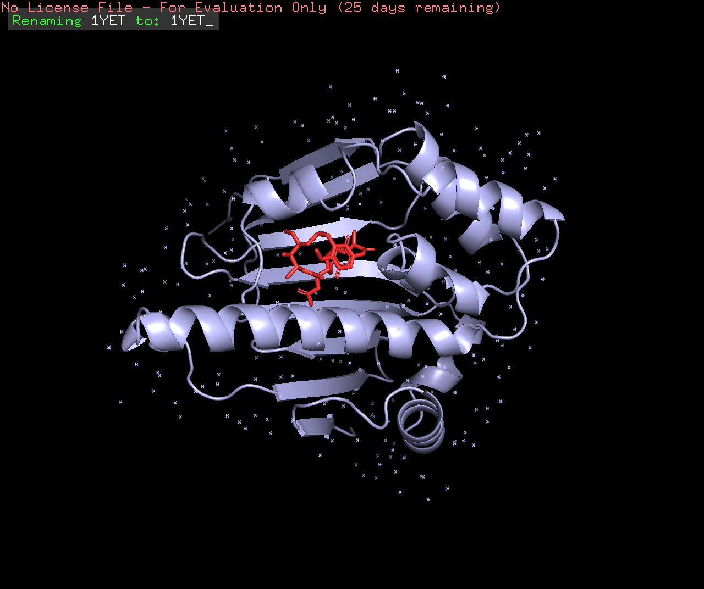
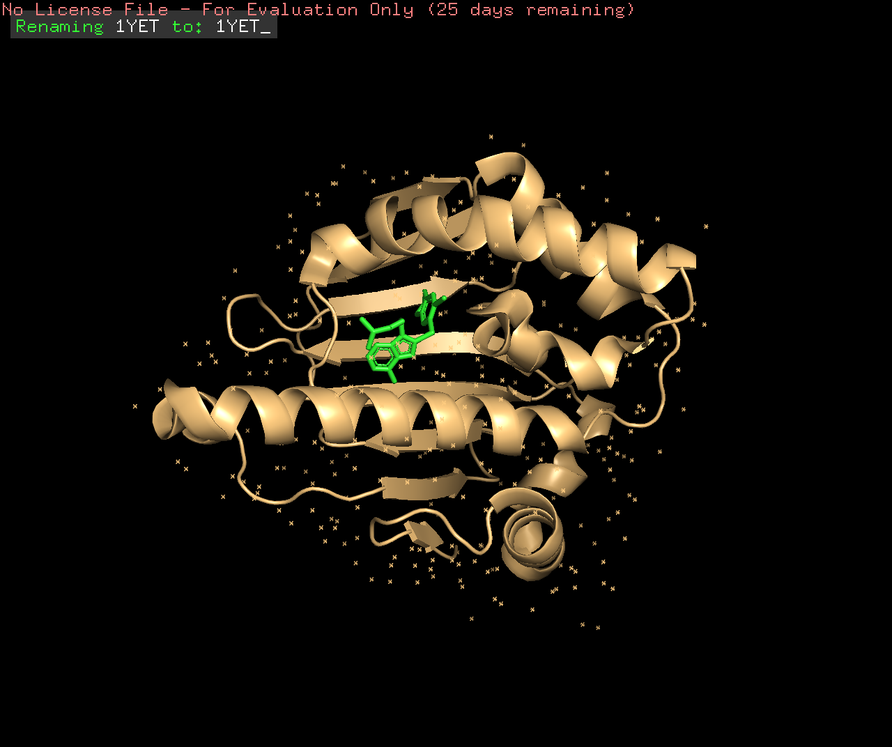
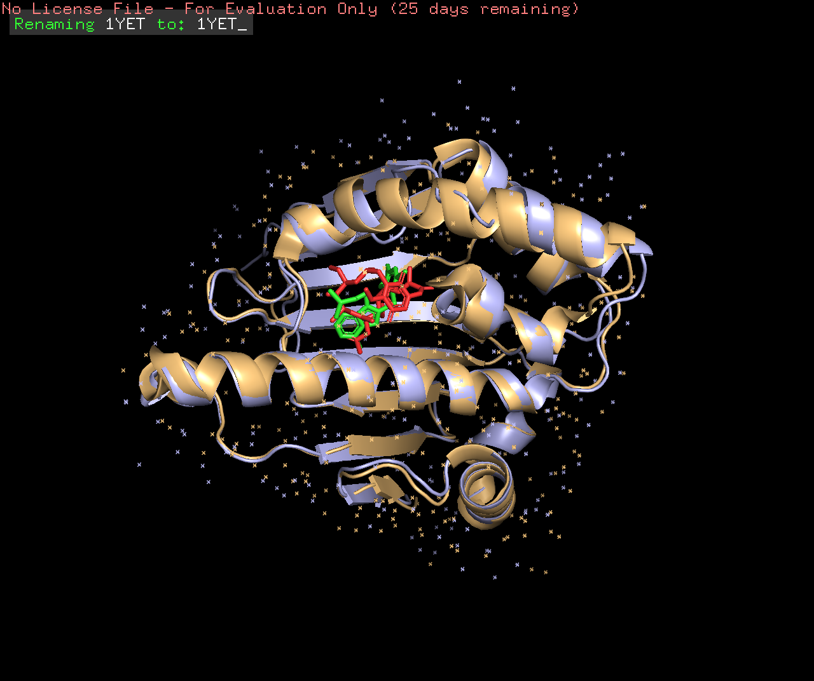

# Introduction

## Scientific Question

HSP90 is a gene associated with breast cancer; what similarities or differences exist between the 3D homology models of the binding sites of 2 potential drugs (17-DMAG & PU-H71), and how successful are those drugs as treatments via analysis of drug tumor retention by targeting HSP90?

## Background on Protein of Interest

Source: https://www.pnas.org/doi/abs/10.1073/pnas.0903392106 & https://aacrjournals.org/cancerres/article/67/7/2932/534569/High-HSP90-Expression-Is-Associated-with-Decreased

My protein of interest in this project is HSP90.

Triple-negative breast cancers (TNBCs) are defined by a lack of expression of estrogen, progesterone, and HER2 receptors. Because of the absence of identified targets and targeted therapies, treatment guidelines for patients with TNBC include only conventional chemotherapy. Such treatment, while effective for some, leaves others with high rates of early relapse. 

Nonetheless, novel drugs for TNBC have come into existence over the past few decades, revolutionizing the field. In this project, I wanted to demonstrate that TNBC is sensitive to the heat shock protein 90 (Hsp90) inhibitors 17-DMAG and PU-H71. As HSP90 serves as a target protein of interest in combatting a deadly cancer like TNBC, I wanted to make it the focus of my project.

## Scientific Hypothesis

If the two HSP90 inhibitor drugs, 17-DMAG and PU-H71, do NOT have significantly different drug tumor retention amounts, then both drugs do NOT have different success rates as breast cancer drug treatments.

# Loading in Packages

No packages are needed for my bioinformatics analysis method (homology modeling) nor my data analysis method (p-values).

## Downloading & Loading All Packages

No packages are needed for my bioinformatics analysis method (homology modeling) nor my data analysis method (p-values).

# Performing Bioinformatics Analysis

## Description of Bioinformatics Method: Homology Modeling 

Homology modeling refers to constructing an atomic-resolution model of the "target" protein from its amino acid sequence and an experimental three-dimensional structure of a related homologous protein (the "template"). Homology modeling relies on the identification of one or more known protein structures likely to resemble the structure of the query sequence, and on the production of an alignment that maps residues in the query sequence to residues in the template sequence. 

Data was taken from the database, PDB. 

I used the PDB accession code 2FWZ, corresponding to "GELDANAMYCIN BOUND TO THE HSP90 GELDANAMYCIN-BINDING DOMAIN".

I used the PDB accession code 2FWZ, corresponding to "Structure of human Hsp90-alpha bound to the potent water soluble inhibitor PU-H71".

I applied the bioinformatics method of homology modeling by taking advantage of the PyMol software, which I used to visualize the different protein structures of HSP90, and its interaction with each HSP90 inhibitor drug, 17-DMAG and PU-H71.

```{r}
## Source: https://www.rcsb.org/structure/1YET
# Using the PDB structure (1YET), we find the location of the HSP90 protein in light purple, and the location of the drug, geldanamycin in red (NOTE: 17-DMAG is a derivative of geldanamycin).

## Source: https://www.rcsb.org/structure/2FWZ
# Using the PDB structure (2FWZ), we find the location of the HSP90 protein in light orange, and the location of the drug, PU-H71 in green.

# When superimposing both structures on top of one another, we find not only an overlap in the structure of the HSP90 protein, but a similar location/structure for the binding site of both drugs, geldanamycin and PU-H71.

```
# Plotting the Results

## Description of Data Analysis Method: P-Values

The p-value is the probability of obtaining test results at least as extreme as the result actually observed, under the assumption that the null hypothesis is correct. 

I applied the data analysis method of p-values by taking using a Welch's t-test, a two-sample location test which is used to test the hypothesis that two populations have equal means.

```{r}
## Source: https://www.tandfonline.com/doi/full/10.1517/17460441.2011.563296?casa_token=P0l2CtuIRnkAAAAA%3AOrAmBwayq_YlxtUSAXdVK9aF26pN_vPr3Nz6a3yXoa-VU5FWW9SB-uKPGgOycUrYSuI638awURYIiw
# Attain data from a reputable scientific article, regarding drug tumor retention amounts when breast cancer HSP70 inhibitor drugs are administered. Read in the csv file and set it equal to a variable name that makes sense.
Drug_Tumor_Retention <- read.csv("Drug Tumor Retention.csv")
Drug_Tumor_Retention
# Make an inference that the two HSP70 inhibitor drugs, 17-DMAG and PU-H71, do NOT have different success rates as breast cancer drug treatments. Calculate the p-values of this hypothesis using a two-sample t-test with unequal variances (Welch-Test).
# First, I assigned the drug tumor retention amounts for each HSP70 inhibitor drug to a variable.
X17DMAG <- Drug_Tumor_Retention[1:2, 7]
PUH71 <- Drug_Tumor_Retention[3:4, 7]
## Source: http://www.sthda.com/english/wiki/unpaired-two-samples-t-test-in-r#compute-unpaired-two-samples-t-test
# Then, I conducted the two-sample t-test with unequal variances, with the two samples being the drug tumor retention amounts for each respective HSP70 inhibitor drug.
welch_test <- t.test(X17DMAG, PUH71)
welch_test
```
# Analyzing the Results

From the data, we can find We use a Welch Test, or an unequal variances t-test, when we want to test whether the means of two populations are equal. In our case, our null hypothesis is that HSP70 inhibitor drugs, 17-DMAG and PU-H71 do NOT have different success rates as breast cancer drug treatments via if they do NOT have significantly different drug tumor retention amounts.

Ultimately, when we run our Welch Test, we find that our p-value is 0.3617. Since our p-value, 0.3617 > 0.05, we fail to reject our null hypothesis. This means that BOTH HSP70 inhibitor drugs, 17-DMAG and PU-H71 do NOT have different success rates as breast cancer drug treatments, as there is NO significant difference between their drug tumor retention amounts.